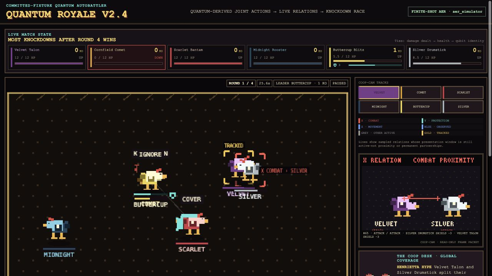

# Quantum Royale V2.4

[Play Quantum Royale](https://dougathlon.github.io/quantum-royale/) · [Technical audit and source](https://github.com/dougathlon/quantum-royale)



Quantum Royale is a spectator autobattler for six pixel chickens. Four continuous 45-second rounds produce one winner: the chicken with the most knockdowns. Damage dealt, remaining health, and stable qubit identity break ties. Between rounds, the spectator can spend fictional points on the eventual winner, change simulation speed, and choose one chicken for Coop-Cam to follow.

The central design question is whether quantum-derived relational data can become something an audience can both experience as a game and reconstruct technically. The public interface therefore keeps two levels together: a legible knockdown race and an exact resolver showing the pair distribution, recorded browser draw, joint outcome, and two resulting actions.

## How to watch

1. Choose a chicken to follow and select **Start match · 1×**.
2. Read the large scoreboard for HP, shield, down state, and cumulative knockdowns.
3. Watch relation lines: grey lines are other active sampled relations; the blue line is the active relation involving the Coop-Cam chicken. Gold marks the tracked chicken.
4. Read the always-visible resolver when an X, Y, or Z event occurs.
5. During each explicit round break, bet or skip, then follow the compact checkpoint chain into the next round.
6. Open **LAB** when you want circuit, provenance, checkpoint, audit, or classical-control detail.

The action families are:

| Context        | `+` action | `−` action | Classical eligibility                                                    |
| -------------- | ---------- | ---------- | ------------------------------------------------------------------------ |
| X · combat     | attack     | guard      | available pair within 58 px                                              |
| Y · protection | cover      | ignore     | injured target and available helper within 170 px; checked before combat |
| Z · movement   | approach   | withdraw   | movement decision every 48 fixed ticks                                   |

A colored line means a sampled relation is still within its presentation window. It does not mean mere proximity or a permanent partnership.

## The exact quantum-to-game chain

```text
authored six-qubit circuit
  → offline QuantumGraph / pairwise-tomography characterization
  → committed checkpoint fixture containing X/Y/Z pair distributions
  → classical movement, injury, availability, and proximity admit an encounter
  → one recorded browser PRNG draw samples the ordered pair's stored joint vector
  → ++, +−, −+, or −− maps to two actions
  → classical game rules apply movement, shield, health, recovery, and score
  → one spotlight event selects an already-computed checkpoint child
```

For every ordered pair `(A, B)`, each checkpoint stores a four-outcome distribution. Ordered-pair reversal is handled explicitly rather than assuming the two positions are interchangeable. One immutable `INTERACTION_RESOLVED` event carries the checkpoint, pair, context, vector, PRNG draw, outcome, actions, consequences, acquisition source, and provenance references. That event drives authoritative state, animation intent, exact resolver, commentary evidence, and the downloadable audit.

The three spotlight outcomes between Rounds 1–3 reduce to a full binary checkpoint path:

- `++` and `−−` select `MATCHED_ACTION`;
- `+−` and `−+` select `SPLIT_ACTION`.

Each selected child circuit and its tomography were computed offline. The branch does not run a circuit or contact a provider during the match.

## What remains classical

All browser-time computation is classical: eligibility, targeting, movement, the pseudorandom draw, damage, shields, cooldowns, knockdown recovery, scoring, betting, checkpoint lookup, commentary selection, final role interpretation, rendering, and audio. The quantum-derived artifact conditions the **joint distribution of two actions** after a classical encounter becomes eligible.

The LAB's event-level product-of-marginals diagnostic keeps the displayed pair's A-plus and B-plus rates exactly the same while removing covariance. It evaluates the same recorded draw against the stored vector and the independent control vector. This is a counterfactual explanation tool, not evidence of quantum advantage.

## QuantumGraph and the offline fixture

The committed fixture was compiled from a six-qubit circuit with a complete K6 gameplay topology. The pinned offline workflow uses QuantumGraph's pairwise-state interface and the pairwise-tomography generator/fitter to characterize all 15 two-qubit pairs at every checkpoint. The current artifact was acquired with local finite-shot Qiskit Aer, not quantum hardware.

The fixture records:

- 15 checkpoints forming a `1 / 2 / 4 / 8` binary tree;
- 15 tomography circuits per checkpoint;
- 4,096 shots per circuit;
- 225 primary tomography circuit executions and 921,600 primary simulated shots;
- acquisition job IDs, seeds, logical/transpiled circuit hashes, raw-count digests, circuit serialization, density matrices, Pauli expectations, fitted distributions, and exact-state diagnostics;
- pinned QuantumGraph commit `6917364b9496bd324225e87e6dd986bce52ecefd` and pairwise-tomography commit `dbab12513281bd8ca7828252cf2e98a1a5749761`.

The browser validates the committed bank at load time. The exact bank is `fixtures/quantum-royale-aer-v1.json`; the readable acquisition/calibration account is `fixtures/compilation-report.md`.

## Claim limits

Quantum Royale does **not** establish:

- entanglement certification;
- quantum advantage, speedup, or hardware feasibility;
- a live QPU, simulator, Python, Moth API, or provider connection during play;
- persistent physical qubits across browser time;
- a semantic social graph generated by QuantumGraph;
- quantum-authored personalities, dialogue, attacks, or meanings;
- that the product control is a universal classical baseline;
- fun, player comprehension, or artistic success merely because the implementation is reproducible.

The final interview roles are classical readings of the completed event history. They do not exist during the match, change probabilities, modify consequences, or determine the winner.

## Run locally

Browser play and normal web verification require only Node 24+, pnpm 11+, and a modern browser:

```sh
pnpm install --frozen-lockfile
pnpm dev
```

Open `http://127.0.0.1:4185/`. The default seed is `260817`; add `?seed=5` for the documented alternate run.

Useful web commands:

```sh
pnpm check:web
pnpm check:artifact
pnpm exec playwright test --list
pnpm test:e2e
```

`check:web` runs formatting, strict TypeScript, all Vitest contracts, and a production build. `check:artifact` rejects source maps, test hooks, local paths, localhost strings, missing notices/assets, and legacy art in the release artifact.

## Fixture regeneration and compiler verification

Regeneration is not needed to play or develop the browser game. It requires the separately pinned Python 3.9 environment described in `compiler/README.md`, including Qiskit 2.2.3, Aer 0.17.2, QuantumGraph, and pairwise-tomography.

```sh
pnpm check:compiler
pnpm compile:dry-run
pnpm compile:fixtures
```

`compile:fixtures` intentionally replaces the committed bank and report; review their hashes and calibration evidence before committing. The compiler's hardware-acquisition interface validates typed batch evidence, but this repository does not implement provider networking or claim a current hardware fixture.

## Testing and determinism

Vitest covers fixture schema/runtime validation, ordered-pair resolution, proximity scheduling, spotlight fallback, betting, role interpretation, audio selection, relation presentation, the pair control, and complete-history determinism. The logical event-history digests remain:

- default seed `260817`: `384397fa0eccde8f8c856f82d60134b9b8befc8d17ae10d2aa6654384229964e`;
- seed `5`: `35c8295892d01200ba66f39fb704082a75dbdd9403fb4ce07b49218a23e3e9d5`.

Those histories are invariant across 1×, 2×, 4×, irregular render partitions, pauses, intermissions, and mid-round speed changes. Coop-Cam, audio, commentary presentation, LAB controls, and the start gate are outside simulation authority.

Playwright covers the public start gate, desktop journey, compact checkpoint/betting pause, pair control, single finale, all six interviews, audit export, restart, seed 5, and the narrow 2×3 scoreboard. The current managed macOS host may reject native Chromium launch with `MachPortRendezvousServer ... Permission denied (1100)`; Linux CI is the release browser authority when that host boundary occurs.

## Architecture

- `src/simulation/`: fixed-tick authoritative match, proximity, consequences, checkpoint selection, roles, commentary events, and immutable history.
- `src/fixtures/`: strict bank validation and ordered-pair fixture resolution.
- `src/presentation/`: presentation focus, centralized active-relation lifetime/priority, projection, and Coop-Cam rendering.
- `src/game/`: Phaser chickens, effects, tracked marker, and active relation lines only.
- `src/ui/`: DOM scoreboard, exact resolver, betting, LAB, classical control, audit export, and finale.
- `src/technical/`: checked-in source excerpts and pure event-level control derivation.
- `compiler/`: optional pinned offline acquisition and tomography pipeline.
- `fixtures/` and `schemas/`: committed artifact, report, and validation schema.
- `tests/`: deterministic unit/integration contracts and browser journeys.

Phaser is a thin renderer. Tracking state, start-gate visibility, and relation-display lifetimes never enter snapshots, PRNG state, betting, or consequential history.

## Deployment

Pull requests run frozen pnpm installation, `check:web`, the release artifact scan, and Linux Playwright. Pushes to `main` deploy the Pages-base production build only after the same release checks pass. The production base path is `/quantum-royale/`; normal builds contain neither the test API nor source maps.

## Licenses and citation

Original source code is MIT-licensed. Original art, prose, fixtures, compilation reports, and QA images are CC BY-NC 4.0. Phaser remains under its MIT license; offline dependencies keep their upstream licenses and are not redistributed. See `LICENSES.md`, `LICENSE`, `LICENSE-CONTENT.md`, and `THIRD_PARTY_NOTICES.md`.

Citation metadata is in `CITATION.cff`.
